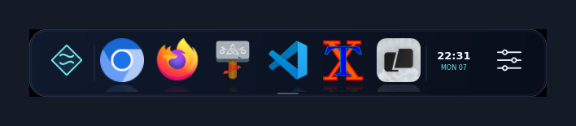
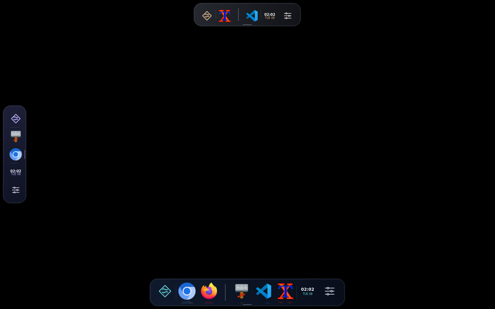
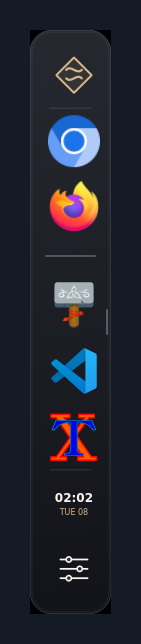
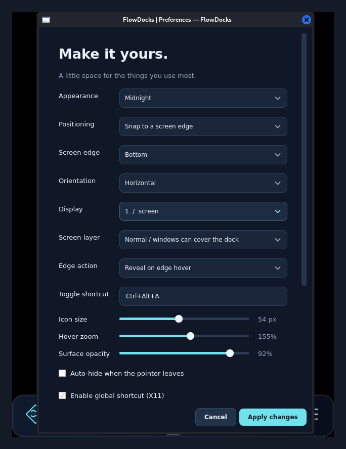

# FlowDocks

[](https://github.com/HashirAhmad-dev/flowdocks/actions/workflows/ci.yml)
[](https://github.com/HashirAhmad-dev/flowdocks/releases)
[](LICENSE)
[](https://www.python.org/)
[](https://pypi.org/project/PyQt6/)

<!-- The release badge is static because shields.io reads the public REST API,
     which cannot see a private repository. Restore the dynamic version at
     https://img.shields.io/github/v/release/HashirAhmad-dev/flowdocks?sort=semver
     once this repository is public. -->

An animated application dock for X11 desktops, built with PyQt6 and a Qt-free
Python backend. Designed for Kali Linux's XFCE session and other Debian-based
desktops.



## Features

- **Translucent animated surface** with hover magnification, icon reflections and
  a launch bounce, in three palettes: Midnight, Graphite and Aurora.
- **Pin anything installed** — drag from the built-in application picker, your
  desktop, a file manager or the applications menu. An insertion marker previews
  placement, and dropping never moves the source file.
- **Arrange by dragging** — reorder pinned icons along the dock, or drag one off
  it to unpin.
- **Separators** group icons the way Nexus Dock does. Add one from the dock menu,
  drag it anywhere along the dock, and drag it off to remove it.
- **Up to five docks at once**, each with its own pinned apps, edge, orientation,
  theme, size and layer. Add or remove them from the Docks menu; one shortcut
  shows and hides them all.
- **Place it anywhere** — snap to any screen edge on any monitor, or switch to
  free positioning and drop it wherever you like, rotated horizontally or
  vertically.
- **Running-window indicators** with click-to-focus, Shift-click for a new
  instance, and a right-click menu listing each open window.
- **Three screen layers** — normal, above or below other windows. Normal is the
  default, so the dock behaves like an ordinary window instead of always sitting
  on top.
- **Show and hide** with a global shortcut, a screen-edge hotspot, the tray icon
  or `flowdocks --toggle`.
- **Control your desktop's own panel** — hide, show, move or configure it without
  leaving the dock.
- **Nothing behind your back** — no root, no service, no network, no telemetry.



<p align="center">
  
  
</p>

## Desktop panel support

FlowDocks sits alongside your desktop's panel rather than replacing it, and can
drive it from the dock menu or preferences.

| Desktop | Hide / show | Move | Settings | Driven through |
| --- | --- | --- | --- | --- |
| XFCE — Kali, Xubuntu, Debian XFCE | yes | yes | yes | `xfconf-query` |
| MATE | yes | yes | no | GSettings |
| Cinnamon | yes | yes | yes | GSettings |
| LXQt | no | no | yes | `lxqt-config-panel` |
| KDE Plasma | no | no | yes | System Settings |
| GNOME | no | no | yes | Settings |
| Budgie | no | no | yes | Budgie Desktop Settings |

Actions a desktop cannot support are greyed out with the reason, never silently
ignored. See [Desktop panel control](docs/desktop-panel.md).

## Installation

Download the `.deb` from the
[releases page](https://github.com/HashirAhmad-dev/flowdocks/releases):

```bash
sudo apt install ./flowdocks_0.5.0_all.deb
flowdocks
```

Or run from source:

```bash
sudo apt install python3-pyqt6 x11-utils xdotool libglib2.0-bin
git clone https://github.com/HashirAhmad-dev/flowdocks.git
cd flowdocks
python3 main.py
```

Or build the package yourself, without root:

```bash
./scripts/build-deb.sh
```

Full details in [Installation](docs/installation.md).

## Usage

1. **Click** an application to focus its window, or launch it if none is open.
   Shift-click always starts a new instance.
2. **Pin** an app by dragging it onto the dock; drag it off again to unpin.
3. **Move** the dock by dragging its grip, clock or empty surface.
4. **Toggle** it with `Ctrl+Alt+A`, the edge hotspot, the tray icon, or
   `flowdocks --toggle`.

> `Ctrl+Alt+D` is deliberately not the default — XFCE binds it to Show Desktop.
> If your chosen combination is already taken, FlowDocks says so rather than
> stealing it from the other application.

```bash
flowdocks --toggle       # Show or hide the running dock, starting it if absent
flowdocks --preferences  # Open preferences in the running dock
```

Full details in [Usage](docs/usage.md).

## Documentation

| Document | Contents |
| --- | --- |
| [Installation](docs/installation.md) | Package, source, building, requirements |
| [Usage](docs/usage.md) | Every interaction, commands, layers, placement |
| [Configuration](docs/configuration.md) | Every settings key, autostart, single instance |
| [Desktop panel control](docs/desktop-panel.md) | Per-desktop support and what is written |
| [Troubleshooting](docs/troubleshooting.md) | Shortcuts, pinning, indicators, Wayland |
| [Contributing](CONTRIBUTING.md) | Layout, tests, and what a change should include |
| [Changelog](CHANGELOG.md) | Release history |
| [Security](SECURITY.md) | Trust model and reporting |

## Testing

The default suite needs no display — the UI tests run on Qt's offscreen platform:

```bash
python3 -m unittest discover -s tests -v
```

Four opt-in suites exercise real integration. Each starts its own Xvfb, D-Bus
session and window manager, and never touches the invoking desktop:

```bash
FLOWDOCKS_TEST_GIO=1 FLOWDOCKS_TEST_X11=1 \
FLOWDOCKS_TEST_PANEL=1 FLOWDOCKS_TEST_APP=1 \
  python3 -m unittest discover -s tests -v
```

They cover real key grabs, EWMH layer changes, moving a private `xfce4-panel`,
and driving the whole application with real pointer drags. They need `xvfb`,
`xauth`, `xfwm4`, `xfce4-panel`, `dbus-daemon`, `x11-utils` and `xdotool`.

## Requirements

| Requirement | Notes |
| --- | --- |
| Python 3.10+ | Satisfied by current Kali, Debian and Ubuntu |
| PyQt6 6.4+ | `python3-pyqt6` |
| X11 session | The supported target; Wayland support is limited |
| `x11-utils`, `xdotool` | Window indicators and activation |
| `libglib2.0-bin` | `gio launch`, honouring desktop-entry field codes |
| `papirus-icon-theme` | Recommended, improves icon coverage |

Enable compositing (**Settings → Window Manager Tweaks → Compositor**) for the
translucent surface. On Wayland, discovery and launching work, but positioning,
the global shortcut, screen layers and window indicators depend on the
compositor — see [Troubleshooting](docs/troubleshooting.md#wayland).

## License

Copyright © 2026 PrismoVector. **All rights reserved.**

FlowDocks is proprietary software, not open source. The source is published
here to be read, not reused: no right to use, copy, modify, redistribute or
publish it is granted. Installing and running an official release is permitted
for personal use; redistributing it is not. See [LICENSE](LICENSE) for the full
terms, or contact info@prismovector.com for licensing enquiries.
